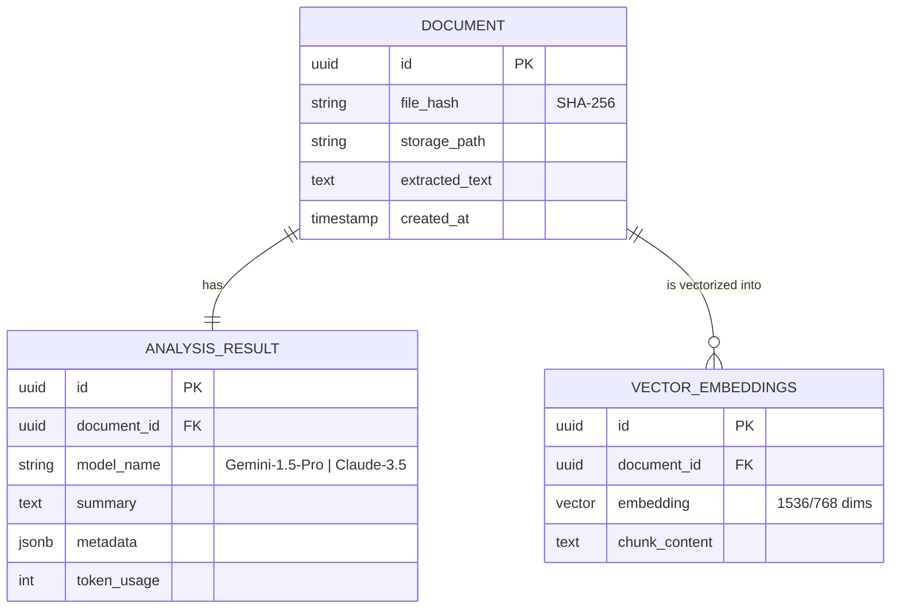

# Entity Relationship Diagram (ERD)

```mermaid
erDiagram
    DOCUMENT {
        uuid id PK
        string file_hash "SHA-256"
        string storage_path
        text extracted_text
        timestamp created_at
    }
    
    ANALYSIS_RESULT {
        uuid id PK
        uuid document_id FK
        string model_name "Gemini-1.5-Pro | Claude-3.5"
        text summary
        jsonb metadata
        int token_usage
    }

    VECTOR_EMBEDDINGS {
        uuid id PK
        uuid document_id FK
        vector embedding "1536/768 dims"
        text chunk_content
    }

    DOCUMENT ||--|| ANALYSIS_RESULT : "has"
    DOCUMENT ||--o{ VECTOR_EMBEDDINGS : "is vectorized into"
```