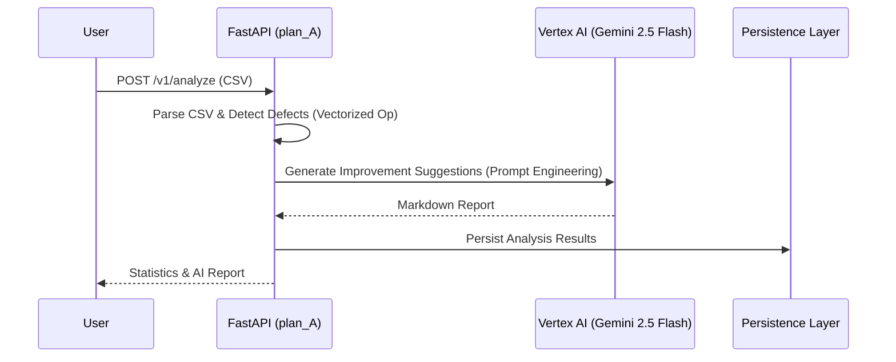

# Sequence Diagram - FlowLens AI

```mermaid
sequenceDiagram
    participant User
    participant API as FastAPI (plan_A)
    participant AI as Vertex AI (Gemini 2.5 Flash)
    participant DB as Persistence Layer

    User->>API: POST /v1/analyze (CSV)
    API->>API: Parse CSV & Detect Defects (Vectorized Op)
    API->>AI: Generate Improvement Suggestions (Prompt Engineering)
    AI-->>API: Markdown Report
    API->>DB: Persist Analysis Results
    API-->>User: Statistics & AI Report
```
