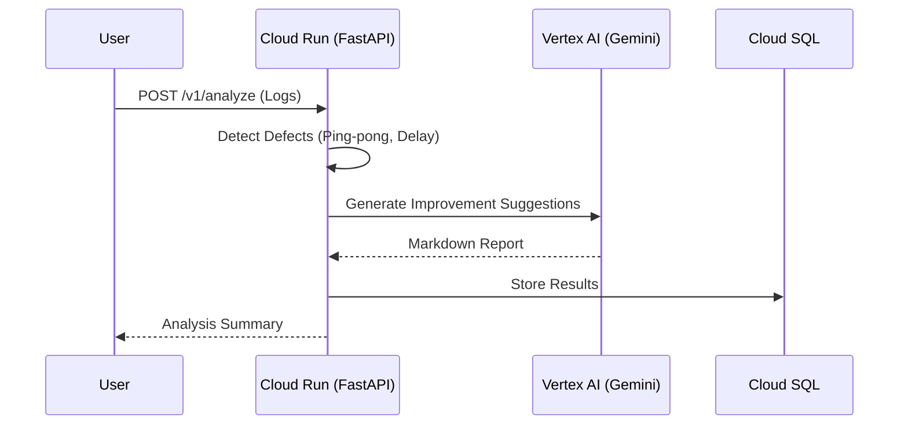

# Sequence Diagram

```mermaid
sequenceDiagram
    participant User
    participant API as Cloud Run (FastAPI)
    participant AI as Vertex AI (Gemini)
    participant DB as Cloud SQL

    User->>API: POST /v1/analyze (Logs)
    API->>API: Detect Defects (Ping-pong, Delay)
    API->>AI: Generate Improvement Suggestions
    AI-->>API: Markdown Report
    API->>DB: Store Results
    API-->>User: Analysis Summary
```